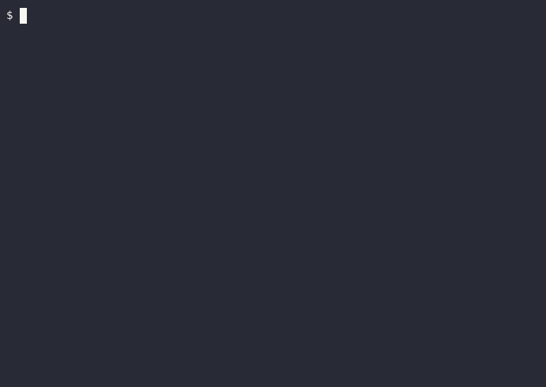

[](https://github.com/guitarrapc/scenario2cast/actions/workflows/build.yaml)

# scenario2cast

English | [日本語](README-ja.md)

Generate [asciinema v2 cast](https://docs.asciinema.org/manual/asciicast/v2/) files from YAML scenario files. You do not need to install or launch `asciinema` to record. Write a YAML scenario with steps, and this tool executes those steps and emits a cast file with simulated typing plus real command output.



**Motivation**

I want to create asciinema cast files without the hassle of recording them. That is the motivation behind scenario2cast. There are various tools in the asciinema ecosystem, but none quite fit: some lean heavily on shell scripts, some require asciinema itself as a dependency, some leak execution paths into the cast output, and some only fake the output rather than running real commands. What I want is something where I can write a scenario plainly, have the listed commands actually executed, and get a cast file generated directly from the real output.

All I need in the end is a cast file, scenario2cast is a cross-platform tool that generates cast files directly from a scenario, without going through asciinema at all.

1. Write the commands to run in the scenario.
2. Generate cast events as if the commands were typed at a steady pace.
3. Execute the commands for real and write their output into the cast.

## Quick Start

Download the asset for your OS from the GitHub Releases page, place `scenario2cast` (or `scenario2cast.exe` on Windows) where you want.

```bash
# On macOS/Linux, add execute permission if needed.
chmod +x ./scenario2cast

# Create a minimal scenario
scenario2cast init scenario.yaml

# Or generate the starter file in the current directory as `scenario.yaml`.
# scenario2cast init

# Run
scenario2cast scenario.yaml [output.cast]

# If `output.cast` is omitted, output is written next to the scenario file with the `.cast` extension.
scenario2cast examples/basic.yaml

# Specify output path
scenario2cast examples/basic.yaml basic.cast

# Play with asciinema
asciinema play basic.cast

# Convert to gif with agg (Linux/macOS)
docker run --rm -v "${PWD}:/data" kayvan/agg /data/examples/basic.cast /data/examples/basic.gif

# Convert to gif with agg (Windows PowerShell)
docker run --rm -v "$($PWD.Path):/data" kayvan/agg /data/examples/basic.cast /data/examples/basic.gif
```

### Demo The README Workflow As A Scenario

If you want to show the exact README flow as a cast/gif demo, use [examples/readme-demo.yaml](examples/readme-demo.yaml).

```bash
# This scenario runs:
# 1) cat examples/basic.yaml
# 2) scenario2cast examples/basic.yaml examples/basic.cast
# 3) docker run --rm -v "$($PWD.Path):/data" kayvan/agg /data/examples/basic.cast /data/examples/basic.gif
scenario2cast examples/readme-demo.yaml examples/readme-demo.cast
```

The scenario intentionally uses per-step `pre-delay` and `post-delay` overrides so each phase has enough pause for explanation.

**Notes**

- Use top-level `shell` to choose the command shell.
- `settings` provides defaults for prompt and timing.
- `init` generates a commented starter scenario so you can start by editing the YAML.
- Avoid interactive commands such as `vim` or `htop`.
- Be careful with commands that change files, the working tree, or external systems.
- `execution-duration` is optional and useful for keeping long commands readable.
- Linux/macOS default: `$SHELL`, fallback to `bash`.
- Windows default: `pwsh`, fallback to `powershell`.
- On Windows, `shell: bash` uses Git Bash / MSYS bash if available.
- `Steps` are executed for real, so be careful with side effects.

## Scenario Format

```yaml
title: "Demo Title"     # Optional cast title
width: 120              # Terminal width (default: 120)
height: 24              # Terminal height (default: 24)
cwd: /path/to/dir       # Optional working directory for all steps
shell: bash             # Optional command shell override

settings:
  prompt: "$ "
  typing-speed: 0.05       # Seconds per character (average)
  typing-jitter: 0.015     # Random jitter (+/- seconds)
  pre-delay: 0.8           # Pause before typing next step
  post-delay: 1.5          # Pause after prompt appears before next step typing
  execution-duration: 0.1  # Optional. Default cast wait per command

steps:
  # Writing a command as a string applies default settings from `settings`
  - echo "Hello, World!"
  - ls -la

  # Writing a command as a mapping allows overriding settings per command
  - run: git log --oneline -10
    post-delay: 3.0

  - run: git status
    typing-speed: 0.10
    pre-delay: 1.5
    post-delay: 2.0

  - run: sleep 2
    execution-duration: 0.4
```

### Command Keys

| Key | Description | Default |
|------|------|-----------|
| `run` | Command to execute | required |
| `typing-speed` | Seconds per typed character | `settings.typing-speed` |
| `typing-jitter` | Typing jitter range | `settings.typing-jitter` |
| `pre-delay` | Pause before command typing | `settings.pre-delay` |
| `post-delay` | Pause after prompt appears | `settings.post-delay` |
| `execution-duration` | Override cast wait for this command execution | `settings.execution-duration` |

## Development

Use `dotnet` for local development, debugging, or publishing.

### Requirements

- .NET 10 SDK (for C# file-based apps)

```bash
# Local run
dotnet run scenario2cast.cs <scenario.yaml> [output.cast]

# build
dotnet publish scenario2cast.cs --self-contained true -p:PublishAot=true -p:StripSymbols=true -p:DebugType=None
```
