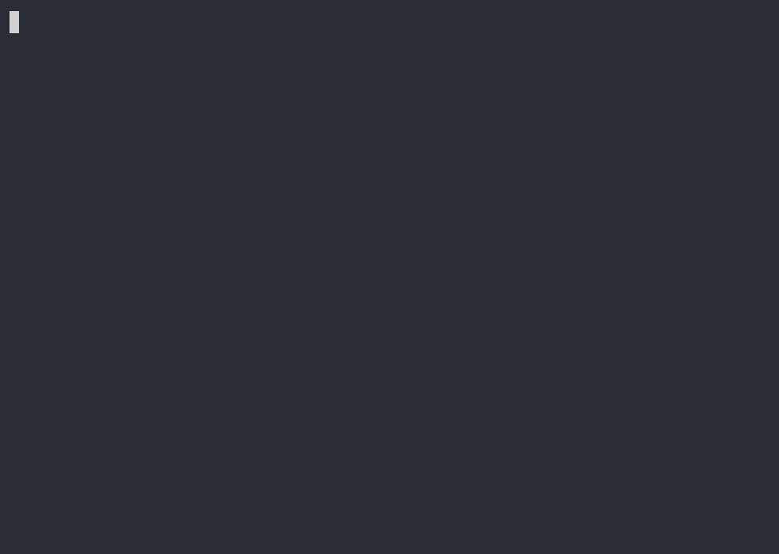

[](https://github.com/guitarrapc/scenario2cast/actions/workflows/build.yaml)

# scenario2cast

English | [日本語](README-ja.md)

Generate [asciinema v2 cast](https://docs.asciinema.org/manual/asciicast/v2/) files from YAML scenario files. You do not need to install or launch `asciinema` to record. Write a YAML scenario with steps, and this tool executes those steps and emits a cast file with simulated typing plus real command output.

Sample scenario `samples/basic.yaml` generates a cast that looks like this when converted to gif, svg...! You don't have to struggle with typing, and since the commands are actually executed, you can easily create realistic demos.

```yaml
title: "Basic Demo"
width: 80
height: 24
shell: bash

settings:
  prompt: "$ "
  typing-speed: 0.02 # average seconds per keystroke
  typing-jitter: 0.01 # random variance (±) per keystroke
  pre-delay: 0.4 # pause before typing starts
  post-delay: 1.0 # pause after output before next step

steps:
  - echo "Hello, World!"
  - name: Name of the step
    run: echo "Current directory:"
  - name: Coloring stdout
    run: curl -I https://google.com
    highlight:
      - color: green
        at:
          - "1"
      - color: gray
        at:
          - "2-12"
  - echo "Wait for 2 seconds..."
  - run: sleep 2
    execution-duration: 1.0
  - echo "stderr output is red by default" 1>&2
  - echo "Done!"
```

| GIF | SVG |
| --- | --- |
|  |  |

**Motivation**

I want to create asciinema cast files without the hassle of recording them. That is the motivation behind scenario2cast. There are various tools in the asciinema ecosystem, but none quite fit: some lean heavily on shell scripts, some require asciinema itself as a dependency, some leak execution paths into the cast output, and some only fake the output rather than running real commands. What I want is something where I can write a scenario plainly, have the listed commands actually executed, and get a cast file generated directly from the real output.

All I need in the end is a cast file, scenario2cast is a cross-platform tool that generates cast files directly from a scenario, without going through asciinema at all.

1. Write the commands to run in the scenario.
2. Generate cast events as if the commands were typed at a steady pace.
3. Execute the commands for real and write their output into the cast.

## Quick Start

Download the asset for your OS from GitHub Releases, then place `scenario2cast` (or `scenario2cast.exe` on Windows) where you want.

```bash
# On macOS/Linux, add execute permission if needed.
chmod +x ./scenario2cast

# Create a starter scenario file in the current directory
scenario2cast init

# Run the scenario to generate a cast file
scenario2cast scenario.yaml

# Generate cast and animated SVG in one command
scenario2cast --format svg scenario.yaml

# Convert an existing cast file to SVG
scenario2cast svg scenario.cast

# Show normal pre/post execution logs while generating a cast file
scenario2cast --verbose scenario.yaml

# Play with asciinema
asciinema play scenario.cast

# Convert to gif with agg (Linux/macOS) - GIF default font size is 16, adjust font size if you feel too small or large
docker run --rm -v "${PWD}:/data" kayvan/agg /data/scenario.cast /data/scenario.gif --font-size 20

# Convert to gif with agg (Windows PowerShell)
docker run --rm -v "$($PWD.Path):/data" kayvan/agg /data/scenario.cast /data/scenario.gif --font-size 20
```

**Usage**

```bash
# Initialize a new scenario file
scenario2cast init [scenario.yaml]

# Run scenario to generate cast
scenario2cast [--verbose] [--format cast|svg] scenario.yaml [output]

# Convert an existing cast file to SVG
scenario2cast svg <input.cast> [output.svg]
```

**Notes**

- `shell`:
  - Linux/macOS default shell is `$SHELL`, with `bash` as fallback.
  - Windows default shell is `pwsh`, with `powershell` as fallback. On Windows, `shell: bash` uses Git Bash / MSYS `bash` when available.
- `settings` provides defaults for prompt and timing.
- `render` controls SVG output and is written to the cast header (`font-size`, `theme`). See [.github/docs/spec_svg.md](.github/docs/spec_svg.md).
- `pre` / `post` run setup and teardown commands outside the recording flow. Their stdout/stderr are printed to the CLI, but are never written to the cast file.
- `steps`:
  - Steps are executed for real, so use caution with commands that modify files or affect external systems.
  - Avoid interactive commands such as `vim` or `htop`.
  - For long-running commands, use `execution-duration` to keep playback readable.

## Scenario Format

```yaml
title: "Demo Title"     # Optional cast title
width: 120              # Terminal width (default: 120)
height: 24              # Terminal height (default: 24)
cwd: /path/to/dir       # Optional working directory for all steps
shell: bash             # Optional command shell override

settings:
  prompt: "$ "
  typing-speed: 0.05       # Seconds per character (average)
  typing-jitter: 0.015     # Random jitter (+/- seconds)
  pre-delay: 0.8           # Pause before typing next step
  post-delay: 1.5          # Pause after prompt appears before next step typing
  execution-duration: 0.1  # Optional. Default cast wait per command
  stderr-color: red        # default color for stderr text when stderr has no ANSI SGR sequences. (default: red)

pre:
  - dotnet build

steps:
  # Writing a command as a string applies default settings from `settings`
  - echo "Hello, World!"
  - ls -la

  # Writing a command as a mapping allows overriding settings per command
  - run: git log --oneline -10
    post-delay: 3.0

  - run: git status
    typing-speed: 0.10
    pre-delay: 1.5
    post-delay: 2.0

  - run: sleep 2
    execution-duration: 0.4

  # run highlight
  - run: git log --oneline -3
    run-highlight: bright-cyan

  # stdout highlight
  - run: git status
    highlight:
      - color: yellow
        at: "4"                   # line 4
      - color: red
        at: "6-7:3-"             # multi-line column band. lines 6-7, columns 3 to end of line
      - color: bright-cyan
        at: "8-"                  # line 8 to end of output

  # stderr highlight (if stderr has no ANSI SGR color)
  - run: echo "plain stderr" 1>&2

  # Override default stderr color for this step
  - run: echo "stderr override" 1>&2
    stderr-color: bright-yellow

post:
  - git clean -fd
```

### Pre/Post Commands

`pre` and `post` are top-level string arrays for setup and teardown commands. They use the same `shell` and `cwd` as `steps`, and each array item is passed to the shell as one command string. Empty entries are ignored.

`pre` runs before `steps`. It is fail-fast: if any `pre` command exits non-zero, later `pre` commands are skipped, `steps` are not executed, the cast file is not written, `post` is not executed, and scenario2cast exits with the failed command's exit code.

`post` runs after `steps` are executed and the cast file is written. It is also fail-fast: if any `post` command exits non-zero, later `post` commands are skipped, the already written cast file remains, and scenario2cast exits with the failed command's exit code.

Recorded `steps` may succeed or fail; either result is recorded and does not determine scenario2cast's exit code. `pre` and `post` are outside the recording flow: their stdout/stderr are printed to the CLI, preserving the original streams, but their command text and output are never written to the cast file.

Use `--verbose` to show successful `pre`/`post` command labels and phase markers. Existing `steps` `running:` logs are always shown. Failed `pre`/`post` commands always print the full command text and exit code.

- `highlight` is step-only (map-form `run` step).
- `run-highlight` is step-only (map-form `run` step).
- `stderr-color` supports both scopes: `settings.stderr-color` default + step `stderr-color` override.
- Existing ANSI on stderr is preserved; `stderr-color` applies only when stderr has no ANSI SGR.

### Style Values (bold/underline/background/intensity)

`highlight.color`, `run-highlight`, and `stderr-color` accept style strings in addition to simple color names.

- Named color: `red`, `bright-cyan`
- Style tokens: `bold`, `underline`, `bright`
- Foreground/background prefixes: `fg:bright-white`, `bg:blue`, `fg:196`, `bg:235`
- Raw SGR literal: `1;31`, `38;5;196`, `48;5;235`, `\e[1;31m`, `\x1b[1;31m`

```yaml
steps:
  - run: git log --oneline -3
    run-highlight: "bold bright-cyan"

  - run: printf 'line1\nline2\n'
    highlight:
      - color: "underline fg:196 bg:235"
        at: "2"

  - run: echo "plain stderr" 1>&2
    stderr-color: "\\e[1;93m"
```

**Color Names (ANSI SGR)**

| Name | ANSI SGR |
|------|----------|
| `black` | `30` |
| `red` | `31` |
| `green` | `32` |
| `yellow` | `33` |
| `blue` | `34` |
| `magenta` | `35` |
| `cyan` | `36` |
| `white` | `37` |
| `bright-black` (`gray`, `grey`) | `90` |
| `bright-red` | `91` |
| `bright-green` | `92` |
| `bright-yellow` | `93` |
| `bright-blue` | `94` |
| `bright-magenta` | `95` |
| `bright-cyan` | `96` |
| `bright-white` | `97` |

For the ANSI 256-color palette, use `fg:<0-255>` or `bg:<0-255>`, or raw SGR `38;5;n` / `48;5;n`.

### Command Keys

| Key | Description | Default |
|------|------|-----------|
| `run` | Command to execute | required |
| `typing-speed` | Seconds per typed character | `settings.typing-speed` |
| `typing-jitter` | Typing jitter range | `settings.typing-jitter` |
| `pre-delay` | Pause before command typing | `settings.pre-delay` |
| `post-delay` | Pause after prompt appears | `settings.post-delay` |
| `execution-duration` | Override cast wait for this command execution | `settings.execution-duration` |
| `run-highlight` | Color the typed command text | none (step-only) |
| `stderr-color` | Default color for stderr when stderr has no ANSI SGR | `settings.stderr-color` |

### settings-only / step-only notes

- `highlight` does not have a `settings` default in this version.
- `run-highlight` does not have a `settings` default in this version.
- `stderr-color` is available in both `settings` and step mapping.

## Development

Use `dotnet` for local development, debugging, or publishing.

### Requirements

- .NET 10 SDK (for C# file-based apps)

```bash
# Local run
dotnet run scenario2cast.cs -- <scenario.yaml> [output.cast]

# build
dotnet publish scenario2cast.cs --self-contained true -p:PublishAot=true -p:StripSymbols=true -p:DebugType=None
```
